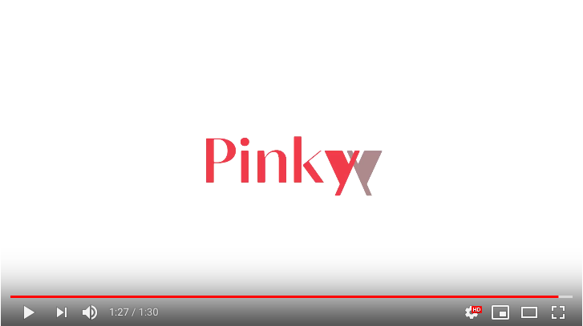

# サンプル（プロダクト名）

## 製品概要
###約束 X Tech

### 背景（製品開発のきっかけ、課題等）
友人や恋人、仕事仲間と会った時にする何気ない口約束、例えば「A君に1000円返す」といった約束をふと忘れることがありませんか？  
また、「金曜18時にハチ公前集合」のような予定型の約束はメモを取るにしても、手帳に書いたりアプリを開いて記録したりして面倒だったり、業務っぽくて味気ないですよね。  
そこで我々は簡単に、かつインタラクティブにお互いの約束を共有できるサービスが必要だと考えました。

### 製品説明（具体的な製品の説明）

### 特長

#### 1. 会ったからこそできる新しい約束の仕方
会ったからこそ口約束で済ませてしまい、その後どちらかがその約束を忘れてしまう。ということがなくなるように簡単に約束を交わすことができます。  
また、お互いの体を用いてインタラクティブに約束を共有するので、楽しくできるのではないでしょうか。

#### 2. いつ、誰と、どんな約束をしたのかを容易に確認できる
アプリでいつでも、これまでに交わした約束の情報が閲覧できます。 
このアプリによってあなたが約束を忘れることはなくなるでしょう。

#### 3. お互いが約束を果たせたことを意識できる
お互いが約束を果たせたということをアプリ内で共有できるので、約束の見落とし防止や過去の振り返りが可能です。  

### 解決出来ること
口約束で済ませてしまう約束から、親友や恋人、家族との大事な約束まで簡単に約束を確認し合えます。
### 今後の展望
- デバイス本体の小型化により、ユーザが身につけても負担に思うほど気にならないようにすることが望まれます。例えば、指輪型にすることで本来の約束を守るカタチの「指切り」に近い方法を実現できるのではないでしょうか。
- 現状1対1の関係での約束しか共有できないので、1対多での約束共有が可能にもできれば良いと思います。

## 開発内容・開発技術
### 活用した技術
#### API・データ
今回スポンサーから提供されたAPI、製品などの外部技術があれば記述をして下さい。

* 形態素解析API（NTTレゾナント）
* 時刻情報正規化API（NTTレゾナント）
* 固有表現抽出API（NTTレゾナント）
* 音声認識API（NTTテクノクロス）

#### フレームワーク・ライブラリ・モジュール
##### クライアント
* Alamofire
* AlamofireImage
* SwiftyJSON

##### サーバ
* Flask
* nginx
* MySQL

#### デバイス
* RaspberryPi3 ModelB
* RaspberryPi2 ModelB

### 独自開発技術（Hack Dayで開発したもの）
#### 2日間に開発した独自の機能・技術
* 独自で開発したものの内容をこちらに記載してください
* 特に力を入れた部分をファイルリンク、またはcommit_idを記載してください（任意）
